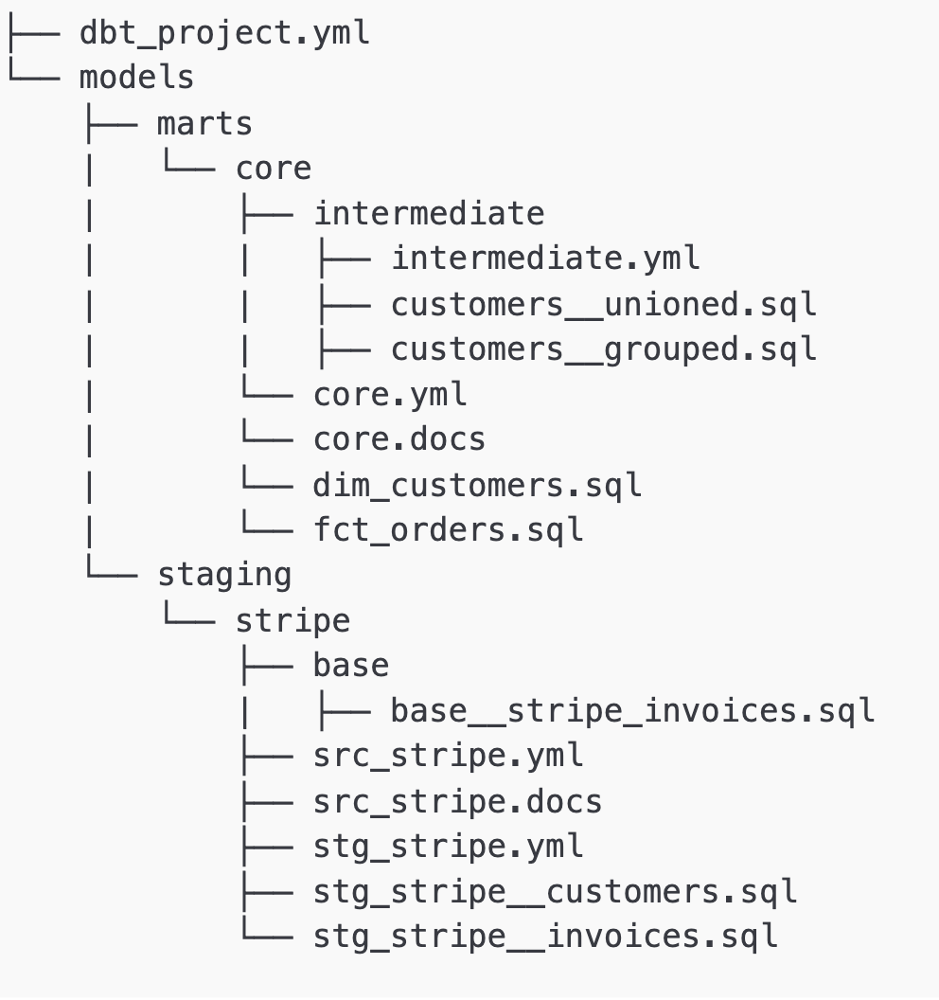
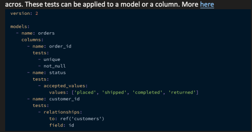

Fundamental of anatomy of DBT.

### 1. profiles.yml
This file contains the database connection that dbt will use to connect to the data warehouse. You only have to worry about this file if you set up dbt locally. 

Since this file can have sensitive information such as project name and database credentials, it is not in your dbt project. By default, the file is created in the folder: ~/.dbt/.

### [2. dbt_project.yml](https://docs.getdbt.com/reference/dbt_project.yml)

Every dbt project needs a dbt_project.yml file — this is how dbt knows a directory is a dbt project. It also contains important information that tells dbt how to operate your project.

### 3. Models
The models folder contains all data models in your project. Inside this folder, you can create any folder structure that you want. A recommended structure put out in the dbt style guide is as follow:

Here, we have the marts and staging folders underneath models. Different data sources will have separate folders underneath staging (e.g. stripe). Use cases or departments have different folders underneath marts (e.g. core or marketing). 

*Notice*: The .yml and .doc files in the example above. They are where you would define metadata and documentation for your models. You can have everything in the dbt_project.yml file, but it is much more cleaner to define them here.

### [4. Seed](https://docs.getdbt.com/docs/build/seeds)
CSV files with static data that you can load into your data platform with dbt.

### [5. Snapshot](https://docs.getdbt.com/docs/build/snapshots)
Snapshot is a dbt feature to capture the state of a table at a particular time. The snapshot folder contains all snapshots models for your project, which must be separate from the model folder.

### [6. Tests](https://docs.getdbt.com/docs/build/data-tests)
Most of the tests in a dbt project are defined in a .yml file under models. These are tests that use pre-made or custom macros. These tests can be applied to a model or a column.

In the example above, when you run dbt test, dbt will check whether orer_id is unique and not_null, status are in the defined values, and every records of customer_id can be linked to a record in the customers table.

### [7. Macros](https://noahlk.medium.com/three-dbt-macros-i-use-every-day-2966b3ad9b26#:~:text=To%20start%2C%20here%20is%20dbt's,folder%20of%20your%20dbt%20repository.)
Pieces of Jinja code that can be reused multiple times.

In dbt, macros are analogous to functions. The recommended way of using macros is by defining them in the dbt/macros folder of your dbt repository.