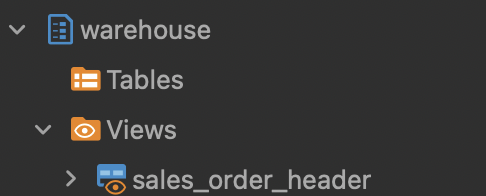

### Create folder `first_run` in `models`.

### Create `schema.yml`. 
This defines the source, and the tables which will be referred. Please note that any table which needs to be referred to using Jinja constructs need to be defined here.

`schema.yml`
```yml
version: 2

sources:
  - name: sales
    database: Adventureworks
    tables:
      - name: salesorderheader
      - name: salesorderdetail
```

### Create sql file.

`sales_order_header.sql`
```sql
SELECT 
    salesorderid, 
    revisionnumber, 
    orderdate, 
    duedate, 
    shipdate, 
    status, 
    onlineorderflag, 
    purchaseordernumber,  
    subtotal, 
    taxamt, 
    freight, 
    totaldue, 
    rowguid as row_id,
    modifieddate
FROM {{ source('sales', 'salesorderheader') }}
```

Here, some columns are being selected from the sales.salesorderheader table, and one column, rowguid is being renamed as row_id. The Jinja syntax `source('sales', 'salesorderheader')` refers to the source previously defined. The documentation states that it.

*Syntax*: `{{ source(source_name, table_name) }}`. Read more [here](https://docs.getdbt.com/reference/dbt-jinja-functions/source?source=post_page-----28e335be5f7e--------------------------------#example).

- `source_name`: The name: defined under a sources: key.
- `table_name`: The name: defined under a tables: key.

### Run job
```bash
dbt run --models first_run
```

*Expected output:*
```bash
Running with dbt=1.7.4
Registered adapter: postgres=1.7.4
Found 3 models, 4 tests, 2 sources, 0 exposures, 0 metrics, 401 macros, 0 groups, 0 semantic models

Concurrency: 4 threads (target='dev')

1 of 1 START sql view model warehouse.sales_order_header ....................... [RUN]
1 of 1 OK created sql view model warehouse.sales_order_header .................. [CREATE VIEW in 0.11s]

Finished running 1 view model in 0 hours 0 minutes and 0.33 seconds (0.33s).
 
Completed successfully

Done. PASS=1 WARN=0 ERROR=0 SKIP=0 TOTAL=1
```

Check the view `sales_order_header` in database.



### Change DBT Materialize
By default, the models are set to materialize as views, and this has been defined in the dbt_project.yml file that was generated by dbt when the project was created. To materialize as tables, we need to change the section in the dbt_project.yml file to:
```yml
models:
  dbt_postgresql:
    # Config indicated by + and applies to all files under models/first_run/
    first_run:
      +materialized: table
```

Or we can change specific in sql file:
```sql
{{ config(materialized='table') }}

SELECT 
    salesorderid, 
    revisionnumber, 
    orderdate, 
    duedate, 
    shipdate, 
    status, 
    onlineorderflag, 
    purchaseordernumber,  
    subtotal, 
    taxamt, 
    freight, 
    totaldue, 
    rowguid as row_id,
    modifieddate
FROM {{ source('sales', 'salesorderheader') }}
```