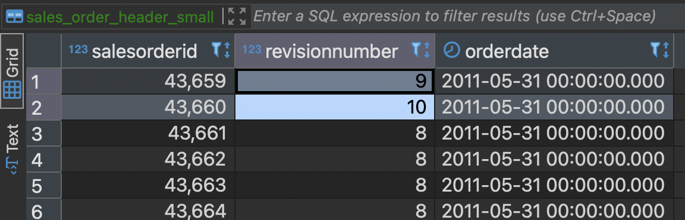

### 1. Create tables
Create `sales_order_header_small.sql` with:
```sql
{{ config(materialized='table')}}


SELECT 
    salesorderid
    , revisionnumber
    , orderdate
FROM {{ source('sales_test', 'salesorderheader') }}
WHERE orderdate < '{{dt}}'
```

Then create `sales_oreder_header_incremental.sql` with:
```sql
{{ config(materialized='incremental', unique_key='orderdate')}}

SELECT 
    salesorderid
    , revisionnumber
    , orderdate
FROM {{ ref("sales_order_header_small") }}
```

### 2. First run
```bash
dbt run --select sales_order_header_small.sql
```

*Expected output*:
```bash
05:09:17  Running with dbt=1.7.4
05:09:17  Registered adapter: postgres=1.7.4
05:09:17  Found 7 models, 12 tests, 6 sources, 0 exposures, 0 metrics, 402 macros, 0 groups, 0 semantic models
05:09:17  
05:09:18  Concurrency: 4 threads (target='dev')
05:09:18  
05:09:18  1 of 1 START sql incremental model warehouse.sales_oreder_header_incremental ... [RUN]
05:09:18  1 of 1 OK created sql incremental model warehouse.sales_oreder_header_incremental  [SELECT 43 in 0.06s]
05:09:18  
05:09:18  Finished running 1 incremental model in 0 hours 0 minutes and 0.16 seconds (0.16s).
05:09:18  
05:09:18  Completed successfully
05:09:18  
05:09:18  Done. PASS=1 WARN=0 ERROR=0 SKIP=0 TOTAL=1
```

Expect just have 43 rows

Then run 
```bash
dbt run --select sales_oreder_header_incremental.sql
```

*Expected output*:
```bash
05:09:17  Running with dbt=1.7.4
05:09:17  Registered adapter: postgres=1.7.4
05:09:17  Found 7 models, 12 tests, 6 sources, 0 exposures, 0 metrics, 402 macros, 0 groups, 0 semantic models
05:09:17  
05:09:18  Concurrency: 4 threads (target='dev')
05:09:18  
05:09:18  1 of 1 START sql incremental model warehouse.sales_oreder_header_incremental ... [RUN]
05:09:18  1 of 1 OK created sql incremental model warehouse.sales_oreder_header_incremental  [SELECT 43 in 0.06s]
05:09:18  
05:09:18  Finished running 1 incremental model in 0 hours 0 minutes and 0.16 seconds (0.16s).
05:09:18  
05:09:18  Completed successfully
05:09:18  
05:09:18  Done. PASS=1 WARN=0 ERROR=0 SKIP=0 TOTAL=1
```

Check data in table `sales_oreder_header_incremental` have 43 rows with `revisionnumber` have all 8.

### 2. Update the source table

Change the content in `sales_order_header_small.sql` to:
```sql
{{ config(materialized='table')}}


SELECT 
    salesorderid
    , revisionnumber
    , orderdate
FROM {{ source('sales_test', 'salesorderheader') }}
WHERE orderdate <= '{{dt}}'
```

Then run:
```bash
dbt run --select sales_order_header_small.sql
```

*Expected output*:
```bash
05:09:31  Running with dbt=1.7.4
05:09:31  Registered adapter: postgres=1.7.4
05:09:31  Found 7 models, 12 tests, 6 sources, 0 exposures, 0 metrics, 402 macros, 0 groups, 0 semantic models
05:09:31  
05:09:31  Concurrency: 4 threads (target='dev')
05:09:31  
05:09:31  1 of 1 START sql table model warehouse.sales_order_header_small ................ [RUN]
05:09:32  1 of 1 OK created sql table model warehouse.sales_order_header_small ........... [SELECT 47 in 0.08s]
05:09:32  
05:09:32  Finished running 1 table model in 0 hours 0 minutes and 0.20 seconds (0.20s).
05:09:32  
05:09:32  Completed successfully
05:09:32  
05:09:32  Done. PASS=1 WARN=0 ERROR=0 SKIP=0 TOTAL=1
```

The table sales_order_header_small have 47 rows and change data in row like



### 2. Update the incremental table
```bash
dbt run --select sales_oreder_header_incremental.sql
```

*Expected output*:
```bash
05:09:53  Running with dbt=1.7.4
05:09:54  Registered adapter: postgres=1.7.4
05:09:54  Found 7 models, 12 tests, 6 sources, 0 exposures, 0 metrics, 402 macros, 0 groups, 0 semantic models
05:09:54  
05:09:54  Concurrency: 4 threads (target='dev')
05:09:54  
05:09:54  1 of 1 START sql incremental model warehouse.sales_oreder_header_incremental ... [RUN]
05:09:54  1 of 1 OK created sql incremental model warehouse.sales_oreder_header_incremental  [INSERT 0 47 in 0.21s]
05:09:54  
05:09:54  Finished running 1 incremental model in 0 hours 0 minutes and 0.35 seconds (0.35s).
05:09:54  
05:09:54  Completed successfully
05:09:54  
05:09:54  Done. PASS=1 WARN=0 ERROR=0 SKIP=0 TOTAL=1
```

The table sales_oreder_header_incremental have 47 rows with new and updated rows.